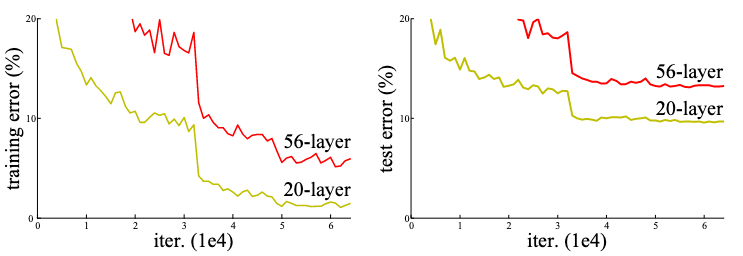
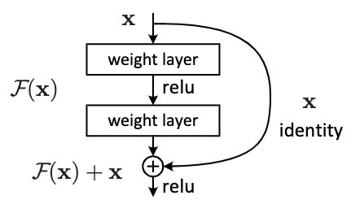
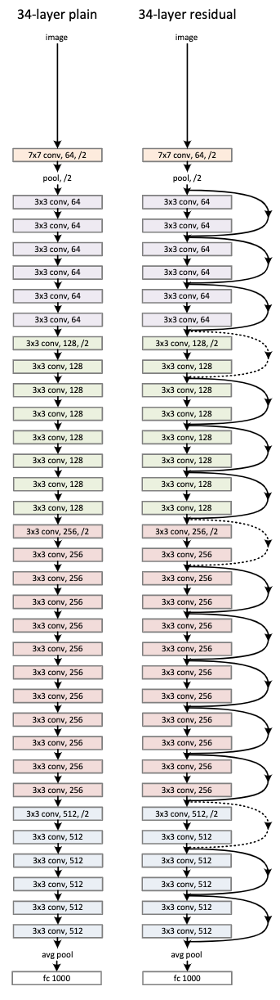
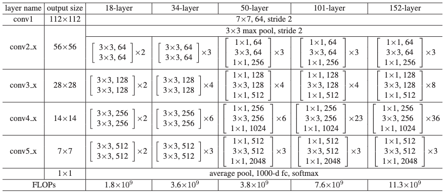
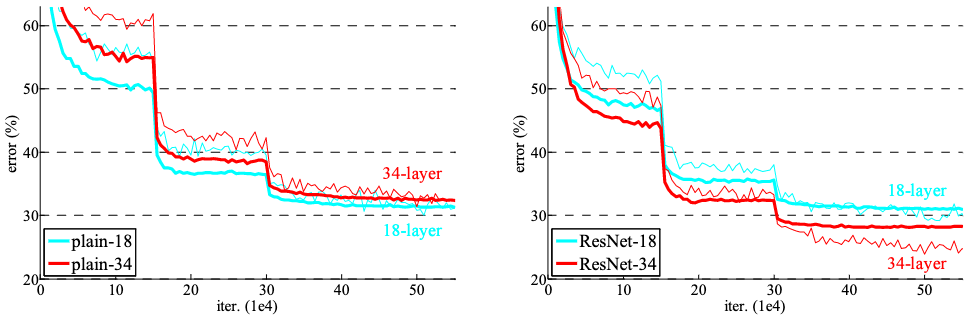
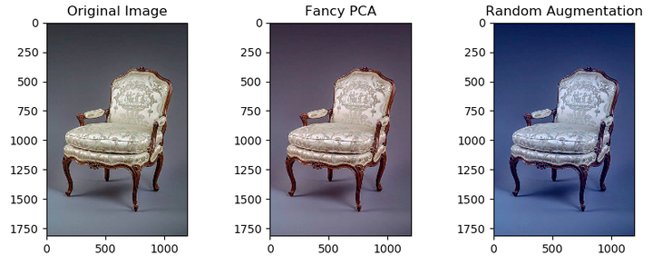
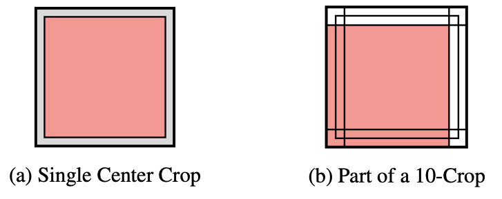

이번에 CNN 기반 backbone network에 대해서 공부할 기회가 생겼다.

이번 글은 CNN 기반 backbone network 중 가장 유명한 ResNet에 대한 리뷰이다.

---

# Introduction

네트워크의 깊이는 성능에 매우 중요한 요소이다.
ImageNet 데이터셋을 학습시킨 많은 모델들이 “very deep (약 16~30 레이어)” 모델을 이용했다.

하지만 깊은 모델을 만들면 다양한 문제가 발생한다.
문제는 크게 2가지로 나뉜다.

하나는 vanishing/exploding gradient이다.
이는 학습시 기울기가 점점 사라지거나, 폭발적으로 커지는 문제인데, 이를 해결하기 위해 xavier's initialization이나 he's initialization과 같은 normalized initialization, 또는 batch normalization과 같은 normalization layer과 같은 방법들이 제시되었다.

다른 하나는 accuracy degradation이다.
이는 모델이 깊어질수록 정확도가 수렴하다가, 일정 깊이부터 정확도가 감소하는 문제를 말한다.
ResNet 논문에서 주목하는 문제가, accuracy degradation이다.
그럼 이에 대해 좀 더 자세히 살펴보자.

|      |
| :---------------------------------------------------------------------: |
| Figure 1. CIFAR 10을 학습한 plain network의 training error(좌)와 test error(우) |

논문에서는 accuracy degradation이 존재한다는 것을 보이기 위해 한 가지 실험을 진행했다.
Plain network[^1]라는 모델을 만들어, CIFAR 10 데이터셋을 학습시키는 것이었다.
이때, plain network의 깊이를 바꿔가며 모델을 학습시켰다.

**Figure 1.** 과 같이, 모델의 깊이는 깊어졌음에도 불구하고 error는 증가한다는 사실을 발견할 수 있었다.
즉, accuracy degradation이 실제로 존재한다는 것을 보인 것이다.

논문에서는 accuracy degradation 문제를 해결하기 위해 한 가지 방법을 제안했다. 
**Shortcut connection**을 활용한 **deep residual learning**이다.

이를 자세히 알아보기 전에, ResNet에 근간이 되는 2가지를 잠깐 살펴보고 넘어가자.

먼저, **residual representation**이다.
Residual representation은 어떤 값과 다른 값의 차이를 이용한 표현법이다.
이 표현법은 주로 데이터 압축과 최적화 문제 해결에 활용한다.

- 데이터 압축에 활용하는 경우
  - Original 값보다 residual representation의 절대값이 작은 경우, 압축에 유리하게 인코딩 가능하다.
- 최적화 문제 해결에 활용하는 경우
  - 최적화 문제를 residual representation으로 변형하면, 최적화 목표 지점에 훨씬 빠르게 도달할 수 있다.
    그 이유는 최적화 목표 지점에 가깝게 시작 지점을 초기화해주기 때문이다.
    종종 preconditioning이라고도 부른다.

그 다음은 **shortcut connection**이다.
Shortcut connection은 말 그대로, 한 지점과 다른 지점을 잇는 지름길이다.
이는 신경망 학습에서 vanishing/exploding gradient 문제를 해결하기 위해 활용된다.

- Vanishing/exploding gradient 문제 해결에 활용하는 경우
  - Gradient가 중간 레이어들을 거치지 않고 shortcut connection을 통해 전파된다.
    덕분에, 온전한 gradient가 레이어들 사이를 이동한다.

---
# Deep Residual Learning

이 섹션에서는 ResNet 논문에서 제안한 deep residual learning에 대해서 설명한다.

What? Why? How? 순서로 설명을 할 것이다.

## What?

### Residual Learning

**Residual learning은 복잡한 함수를 residual representation을 이용해 근사하는 방법이다.**

Residual learning을 바로 설명하기 전에, 원래 함수를 어떻게 residual representation으로 표현하는지 먼저 알아보자.

- $H(x)$: 원래 함수이다. 여러 개의 non-linear layer를 쌓아 올려 만든 함수이고 복잡한 함수를 근사할 수 있다.

- $F(x):=H(x)-x$: 원래 함수에서 입력 값을 뺀 residual representation이다. (이때, 입력 $x$와 출력 $H(x)$의 차원은 동일하다 가정한다.)

위 두 함수를 가지고, 아래와 같이 원래 함수 $H(x)$를 $F(x)$에 대한 식으로 치환할 수 있다.

- $H(x)=F(x)+x$

$H(x)$를 곧장 이용하지 않고, $F(x)+x$로 치환하면 신경망 모델을 조금 더 쉽게 학습할 수 있다.
왜 그런지는 아래에서 조금 더 살펴보겠다.

## Why?

### Thought Experiment

**왜 residual representation을 이용하는가?**

논문에서는 사고 실험을 통해, 이유를 정당화한다.
단순히 정당화에서 그치는 건 아니고,  **Analysis of Layer Responses** 섹션에서 실제 실험을 통해 증명도 한다.

그럼 다시 사고 실험 이야기로 돌아와서 어떤 이유에서 residual representation을 이용하는지 알아보겠다.

- **Shallow model A**가 있다고 가정해보자. 모델 A를 바탕으로 3가지 모델을 만들어보면서 이유를 설명하겠다.

  1. **Deep model A'** : A'은 A의 뒷 단에 identity layer를 쌓아 만든 모델이다.
    - A와 A'의 출력 값은 동일할 것이다. 즉, training error가 동일할 것이다.
    - A'이 최적의 모델 (optimal model)이라고 가정해보자. A'보다 더 나은 모델은 세상에 없다.

  2. **Deep model B** : B는 A의 뒷 단에 non-linear layer들을 쌓아 만든 모델이다.
    - A의 뒤에 일반적인 신경망 연산들을 쌓아 올릴 모델이란 의미이다.
    - 만약 B의 학습이 잘 진행되고 있다면, B는 최적의 모델인 A'과 점점 동일해질 것이다.
      즉, non-linear layer들은 identity layer들을 모방하게 될 것이다.
    - 하지만 accuracy degradation 문제에서 알 수 있듯, identity layer에 가까워지지 않는다.

  3. **Deep model B'** : B'은 A의 뒷 단에 residual representation을 포함해 non-linear layer들을 쌓아 만든 모델이다.
    - B'의 non-linear layer들은 학습을 할 때, 모든 파라미터를 0으로만 만들어도 최적의 모델 A'을 얻을 수 있다.

  - 위 사고 실험은 모델 A'이 최적의 모델이라는 가정 하에 성립한다. 하지만 실제로는 A'이 최적의 모델이 아닐 것이다.
    그렇다 하더라도 B'과 같이 모델을 만들게 되면, 조금 더 학습이 잘 될 것으로 기대할 수 있다. 
    그리고 실제로 이를 증명하기 위해, 논문에서는 한 가지 실험을 추가했다. 이는 아래에서 자세히 설명하도록 하겠다.

## How?

### Identity Mapping as a Shortcut

ResNet은 **building block**이란 단위로 residual learning을 적용한다.

여기서 building block은 shortcut connection을 통한 residual learning이 적용된 블럭이다.
ResNet은 building block이 기본 구성 단위이기 때문에, building block을 쌓아 올려 신경망 모델을 구성한다.

Building block은 아래 수식 조건을 만족한다면, 어떻게 구성하더라도 상관없다.

$$ y=F(x, W_i) + x$$

- $x$, $y$는 각각 입력과 출력 벡터.
- $F(x, W_i)$는 학습시킬 residual mapping.
- $F+x$는 element-wise addition으로, shortcut connection을 의미.
- Shorcut connection 이후 non-linearity를 적용할 것.

아래의  **Figure 2** 는 실제로 ResNet-18, 34에 적용한 building block이다.

|  |
| :---------------------------------------------: |
| Figure 2. Residual learning이 적용된 building block |

**Figure 2** 의 그림을 위에서 서술한 수식에 빗대어 표현하면,

$$F=W_2 \sigma(W_1 x),\ \ y=\sigma(W_2\sigma (W_1 x)+x)$$

- $\sigma$는 ReLU 함수.
- Bias는 편의상 생략.

로 표현이 가능하다.

Shortcut connection으로 linear projection $W_s$를 적용할 수도 있지만, ResNet에서는 단순한 element-wise addtion을 적용했다.
후술할 실험 결과에서 확인할 수 있는데, linear projection는 연산 오버헤드에 비하면 신경망 모델의 성능 향상이 그리 크지않다.
따라서 ResNet에서는 element-wise addtion을 shortcut connection으로 사용한다.

만약, linear projection을 shortcut connection으로 사용한다면, 출력인 $F(x)$와 입력인 $x$의 차원에 따라 다른 방식을 적용해야 한다.
둘의 차원이 다르다면, 차원을 동일하게 맞춰줄 수 있도록 $W_s$의 형상을 결정해줘야한다.
하지만, 둘의 차원이 같다면, $W_s$의 형상은 정사각행렬로 결정하면 된다.

### Network Architectures

|  |
|:---:|
|Figure 3. PlainNet(좌): 3.6B FLOPS, ResNet(우): 3.6B FLOPS|

#### Plain Network

  아래 서술하는 VGG의 철학을 따른다.

  - 3x3 필터 사용
  - 같은 크기(가로, 세로)의 OFM을 갖는 레이어들은 모두 필터의 개수가 같아야 함
  - OFM의 크기(가로, 세로)가 반으로 줄면 필터의 개수는 2배로 증가해야함
  - OFM의 크기를 반으로 줄일 때는, stride를 2로 갖는 convolutional layer를 이용

  이외에도 모델을 아래와 같이 수정했다.

  - 모델의 마지막 부근에 global average pooling과 1000-way FC layer를 이용
  - 모델의 출력 레이어는 softmax를 이용

#### Residual Network

  Plain Network와 거의 동일한 모델 구조를 가진다.

  대신 아래와 같은 차이를 가진다.

  - Shortcut connection이 추가됨

    - Dimension이 같다면 identity mapping을 이용한 shortcut(실선)
    - Dimension이 다르다면 2가지 방법을 이용해 dimension을 일치시키는 shortcut(점선)
      - Zero-padding을 추가한 identity mapping
      - 1x1 convolution을 이용한 linear projection

### Implementation

여기서는 실험에서 사용된 모델들의 학습과 실험 방법에 대해서 설명한다.

#### Image preprocess

  - 이미지의 짧은 방향을 \[256, 480\]으로 random resize
  - Random horizontal flip
  - 224x224 random crop
  - Per-pixel mean으로 subtraction
  - PCA color augmentation(Fancy PCA)[^2] 적용

#### Train

- Optimizer: SGD
- Weight decay: 0.0001
- Momentum: 0.9
- Mini-batch size: 256
- Learning rate: 0.1 → training error가 개선되지 않을때마다 10으로 나눔
- 60 x 10^4 iterations

#### Test

- 10-crop testing[^3] 활용
- Multiple scale resize[^4]

---

# Experiments

여기선 ResNet 논문에서 실험한 결과를 중요한 일부만 다루겠다.

## PlainNet vs ResNet

ImageNet 2012 classification dataset에 대한 실험이다.

|  |
|:---:|
|Figure 4. 실험에서 사용한 ResNet 모델들의 구조|

|  |
|:---:|
|Figure 5. ImageNet 2012 학습을 반복하며 나타난 training error|

실험에서 사용한 신경망 모델의 구조는 **Figure 4** 과 같고, 여기선 학습을 하면서 training error가 어떻게 바뀌었는지를 살펴보도록 하겠다 (**Figure 5**).

### PlainNet

PlainNet에서는 34-layer의 모델이 18-layer 모델보다 더 나쁜 training error와 validation error를 보였다.
즉, accuracy degradation 발생했다.

다음과 같은 이유로 vanishing gradient로 인한 문제는 아니라고 주장한다.
- Batch normalization 덕에 forward propagation의 activation 값이 non-zero variance를 갖는다는 것을 확인
- Backward propagation의 gradient 분포 역시 고르다는 것을 확인

자세한 이유를 규명하는 일은 future work로 남기겠다고 한다.

### ResNet

전반적으로 34-layer의 모델이 18-layer 모델보다 좋은 training error와 validation error를 보였다.

PlainNet과 비교 결과는 아래와 같다.
- 34-layer 모델을 PlainNet과 비교 시, 같은 깊이의 모델이더라도 **더 좋은 성능**
- 18-layer 모델을 PlainNet과 비교 시, 모델 성능은 비슷하지만 **빠른 수렴 속도**

## 그 외 실험들

이 외에도 논문에서는 많은 실험을 했다.
- Shortcut connection으로 identity mapping을 쓰는 것과 linear mapping을 쓰는 것은 얼마나 차이나는지?
- Bottleneck 구조를 깊게 만들면 결과는 어떤지?
- 신경망 모델이 전체적으로 깊어지면 성능은 얼마나 바뀌는지?
- 각 layer의 출력의 분포는 어떤지?

이번 포스트에서 다루진 않을 예정이며 여기서 마무리 짓도록 하겠다.

---

# 마무리

어렴풋이 구조만 들어왔던 논문이었는데, 회사 업무 때문에 자세히 읽어보게 됐다.
이유없이 shortcut connection을 쓴 건 아니었단걸 알게 됐다.

다만 본인들의 논리인, *"identity function과 optimal model은 좀 더 비슷할 것이다."*를 조금 더 뒷받침하려면,
  bottleneck 모듈의 마지막에는 activation function인 ReLU를 넣지 않았어야 했는데, 그게 좀 아쉬웠다.
실제로 후속 연구들에서는 ReLU를 넣지 않고 더욱 더 좋은 실험 결과를 보여주긴 한다.

아무튼 재미있게 읽었던 논문이고 왜 이렇게 인용이 많이 됐는지, 저자들의 노고를 알 수 있는 좋은 기회였다.

---
# 참고 자료
- He, Kaiming, et al. "Deep residual learning for image recognition." Proceedings of the IEEE conference on computer vision and pattern recognition. 2016.

[^1]: Plain Net은 VGG를 기반으로 만든 모델이다. 모델의 자세한 구조는 [Network Architectures](#network-architectures)를 참고.
[^2]: Facny PCA란?  AlexNet에서 활용된, RGB 채널을 자연스럽게 변화시키는 data augmentation 방식이다. 다음 그림은 Facny PCA의 예시이다. . 참고: [pca_color_augment (aparico.github.io)](https://aparico.github.io/)
[^3]: 10-crop testing이란? 이미지를 10가지 방식으로 크롭해 최고의 결과를 선택해 신경망을 테스트하는 방식이다. 다음 그림은 10-crop testing의 예시이다. . 참고: Kim, Hansohl. "Residual Networks for Tiny ImageNet." CS-231N Final Project Report (2016).
[^4]: Multiple scale resize란? VGG에서 사용한 테스트 방법으로, Fully-Convolutional Network(FC layer를 Conv layer로 모두 교체)를 사용해, 여러 사이즈의 이미지를 테스트하는 방법이다. 참고: Simonyan, Karen, and Andrew Zisserman. "Very deep convolutional networks for large-scale image recognition." arXiv preprint arXiv:1409.1556 (2014).

