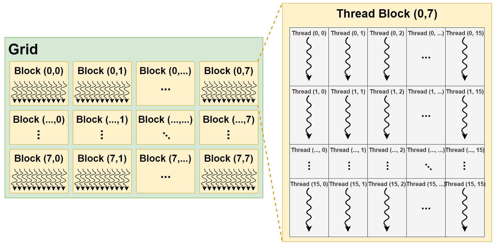
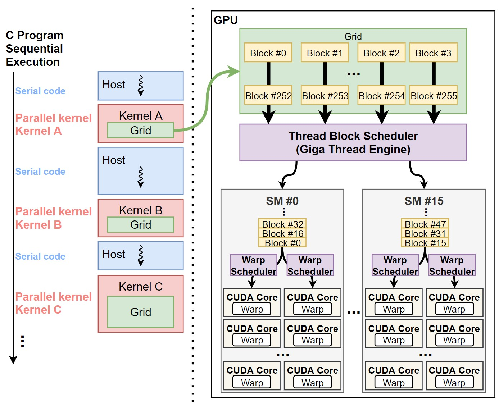
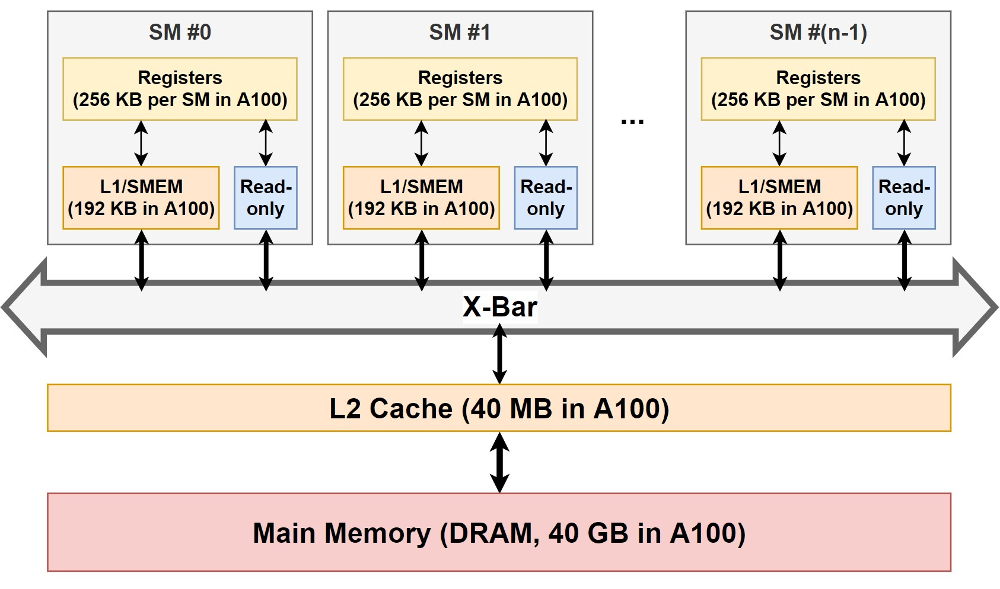
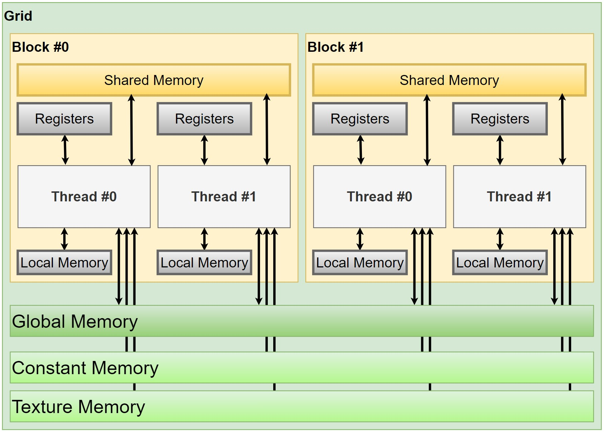

GPU의 프로그래밍 모델은 GPU 하드웨어의 동작과 다르게 설계되어 있다.
이는 프로그래밍의 편리성을 증대시키기 위해서인데, 덕분에 프로그래머는 편리하게 GPU를 사용할 수 있게 되었다.

이번 게시글에서는 GPU의 프로그래밍 모델, 그 중에서도 CUDA 프로그래밍 모델에 대해 알아보도록 하겠다.

현대의 GPU는 SIMD 하드웨어를 이용하기 때문에, data-level parallelism을 활용한 어플리케이션을 가속한다.
하지만 GPU 프로그래밍 모델은 SIMD 하드웨어를 프로그래머에게 노출하지 않는다.
SIMD 하드웨어를 노출하게 되면, 하나의 instruction이 적용될 여러 data들을 프로그래머가 직접 지정해야 하는데,
이는 프로그래밍 난이도를 증가시키기 때문이다.

대신 CUDA나 OpenCL 같은 프로그래밍 모델은 MIMD-like 프로그래밍 모델을 채용한다.
따라서 각 쓰레드에 대한 스칼라 프로그래밍이 가능하며, GPU에서 스칼라 쓰레드들이 개별적으로 구동하는 것처럼 보이게 한다.
GPU 하드웨어는 런타임에 쓰레드를 warp[^1]라고 부르는 단위로 묶고, warp에 속한 여러 쓰레드를 SIMD와 같은 방식으로 동시에 처리한다.
이런 동작 모델을 SIMD와 구분짓기 위해 SIMT (Single-Instruction Multiple-Threads)라 부르게 되었다.

----

# Programming Model

CUDA는 C/C++을 기반의 API를 제공하기 때문에, 프로그래머가 입문하기 쉽다.
또한 위에서 언급한 바와 같이 스칼라 프로그래밍이 되기 때문에, 컴파일러가 자동적으로 GPU에 쓰레드들을 warp 단위로 할당한다.

CUDA 프로그래밍 모델에는 크게 3가지의 특징이 있다.

1. CUDA blocks - 쓰레드들을 묶은 그룹
2. Shared Memory - 블록끼리 공유하는 메모리 영역
3. Synchronization Barriers - 모든 쓰레드들이 도달할 때까지 쓰레드의 진행을 가로막는 API

위와 같은 특징들 덕분에, 프로그래머들은 어렵지 않게 CUDA 프로그램을 짤 수 있다.
특징들은 이후 자세하게 설명할 예정이다.

그 전에, 코드 예시를 보고 CPU 코드와 GPU 코드의 차이에 대해 알아보자.

```c++
void saxpy_serial(int n, float a, float *x, float *y) {
  for (int i = 0; i < n; i++)
    y[i] = a*x[i] + y[i];
}

int main() {
  float *x, *y;
  int n;
  // omitted: allocated CPU memory for x and y and initialize contents
  saxpy_serial(n, 2.0, x, y);   // Invoke serial SAXPY kernel
  // omitted: use y on CPU, free memory pointed to by x and y
}
```

```c++
__global__ void saxpy(int n, float a, float *x, float *y) {
  int i = blockIdx.x * blockDim.x + threadIdx.x;
  if (i < n)
    y[i] = a*x[i] + y[i];
}

int main() {
  float *h_x, *h_y;
  int n;
  // omitted: allocate CPU memory for h_x and h_y and initialize contents
  float *d_x, *d_y;
  cudaMalloc( &d_x, n * sizeof(float) );
  cudaMalloc( &d_y, n * sizeof(float) );
  cudaMemcpy( d_x, h_x, n * sizeof(float), cudaMemcpyHostToDevice );
  cudaMemcpy( d_y, h_y, n * sizeof(float), cudaMemcpyHostToDevice );
  int nthreads = 256;
  int nblocks = (n + nthreads-1) / nthreads;
  saxpy<<<nblocks, nthreads>>>(n, 2.0, d_x, d_y);
  cudaMemcpy( h_y, d_y, n * sizeof(float), cudaMemcpyDeviceToHost );
  // omitted: use h_y on CPU, free memory pointed to by h_x, h_y, d_x, and d_y
}
```

두 코드는 모두 **saxpy (single-precision scalar value A times vector value X plus vector value Y)** 라 불리는 연산을 구현한 것이다.
위 코드는 CPU를 이용한 코드이기 때문에 직렬로 프로그래밍 되어 있고, 아래 코드는 GPU를 이용한 코드이기 때문에 병렬로 프로그래밍 되어 있다.

먼저 두 코드 모두 `main` 함수는 제외하고 `saxpy...` 함수만 살펴보자.

- `saxpy_serial`의 경우 for-loop을 돌면서 연산을 실행한다.
`x[i]`와 `y[i]`는 서로 간의 의존성이 없음에도 불구하고, 반복문으로 인해 연산 속도는 느려진다.
- `saxpy`의 경우 for-loop을 사용하지 않고 쓰레드의 좌표 값인 `i`만을 이용한다.
따라서 서로 간의 의존성이 없는 `x[i]`와 `y[i]`는 병렬 연산이 가능하고, 덕분에 빠른 연산이 가능하다.

이제 `main` 함수를 살펴보면 좀 더 뚜렷한 차이를 확인할 수 있다.

- 먼저 CPU 함수의 경우, 단순히 `saxpy_serial` 함수만 호출해 사용하면 된다.
- 하지만 GPU 커널은 조금 더 많은 사전/사후 작업이 필요하다.
먼저 host memory에서 사용할 포인터와 device memory에서 사용할 포인터, 두 가지를 구분해서 선언해야 한다.
관례적으로 host memory와 device memory는 prefix로 각각 `h_`, `d_`를 붙인다.
그리고 host memory에 메모리 공간과 값을 할당했다면, device memory 역시 메모리 공간과 값을 할당해준다.
할당을 위해 각각 `cudaMalloc`, `cudaMemcpy`라는 API를 사용한다.
이후 kernel을 호출하게 되는데, 이때 CUDA block당 쓰레드의 개수인 nthreads, CUDA block의 개수인 nblocks를 `<<< >>>`에 지정해 GPU에서 동작할 CUDA block의 개수와 크기를 결정한다.
마지막으로 연산이 끝난 device memory의 데이터를 CPU에서 사용하기 위해 `cudaMemcpy`로 다시금 불러온다.

## Thread Blocks

GPU 컴퓨팅 어플리케이션의 커널은, **Figure 1.** 과 같이 Grid, Block[^2], Thread의 계층으로 구성된다.

|  |
| :---------------------------------------------------------------------------- |
| Figure 1. CUDA 프로그램의 쓰레드 계층 구조                                                |

쓰레드를 계층 구조로 만들어 이용하면 몇 가지 장점이 있다.

첫 번째로, 병렬 연산 프로그래밍에 용이하다.
- 각 쓰레드는 `dim3`라는 자료 구조의 `blockDim`, `blockIdx`, `threadIdx`이란 변수들을 이용해 접근이 가능하다.
위 방식을 잘 이용하면 2D나 3D 행렬 연산 시, 각 요소의 위치를 쓰레드로 할당해 프로그래밍하기 훨씬 수월하게 만들어준다.
대부분의 과학 연산 어플리케이션은 행렬 연산을 주로 사용하기 때문에, 큰 이점이 있다.

두 번째로, GPU 하드웨어에 쓰레드를 할당하기 용이하다.
- 앞서 말했듯, SIMT를 이용하는 하드웨어와 달리, 프로그래밍 모델은 MIMD를 이용한다.
그렇기 때문에 프로그래밍 된 스칼라 쓰레드들을 효율적으로 GPU 하드웨어에 스케쥴링 할 수 있는 방법이 필요하다.
이때 쓰레드를 계층 구조로 구성하면, 컴파일러와 하드웨어만으로 SIMT 구조를 프로그래머에게 노출하지 않으면서, 쓰레드를 하드웨어에 스케쥴링 할 수 있다.
하나의 커널은 하나의 grid로 구성이 되어 있고, GPU 커널을 실행하게 되면 이 grid는 GPU에 할당이 된다.
Grid 내의 각 block들은 Thread Block Scheduler ([이전 챕터 Figure 3-1.](../gpgpu-architectures-chap1))를 통해 SM으로 스케쥴링 되고,
  block 내의 thread들은 warp 단위로 실제 연산 코어인 CUDA core에 스케쥴링 된다.
위 과정은 **Figure 2.** 에서 좀 더 자세히 확인할 수 있다.

|  |
| :---------------------------------------------------------------------------- |
| Figure 2. CUDA 쓰레드 스케쥴링 과정. 쓰레드 계층은 일반 글씨체로, GPU 하드웨어는 굵은 글씨체로 표시되어 있다.       |


## Memory Hierarchy and Memory Spaces

NVIDIA GPU는 프로그래밍의 편의성을 위해, 메모리 구조 역시 하드웨어와 소프트웨어가 분리되어 있다.

### Memory hierarchy in HW perspective

**Figure 3.** 와 같이, 하드웨어 관점에서 메모리 계층구조는 일반적인 컴퓨터 시스템의 메모리 계층구조와 비슷하다.

|  |
| :---------------------------------------------------------------------------- |
| Figure 3. NVIDIA GPU의 하드웨어 메모리 계층 구조. 각 메모리의 용량은 NVIDIA A100을 기준으로 작성되었다.     |


- **Main memory**:
  DRAM이나 HBM으로 이뤄진 메인 메모리이다. 가장 크기가 크지만, 접근 속도가 가장 느리다.

- **L2 Cache**:
  L2 캐시는 SRAM으로 이뤄진 메모리이다. 모든 SM이 접근 가능하며, main memory보다 접근 속도가 빠르다.
  캐시 메모리 중 가장 큰 용량을 가지고 있다.

- **Read-only memory**:
  SM 마다 존재하는 메모리이다. Constant Cache ([이전 챕터 Figure 3-2.](../gpgpu-architectures-chap1))가 read-only memory이다.
  SM 마다 존재하며 L2 Cache보다 접근 속도가 빠르지만 크기가 제한적이다.
 
- **L1 Cache / Shared memory (SMEM)**:
  L2 Cache와 마찬가지로 SRAM으로 이뤄진 메모리이다. 각 SM 마다 존재하기 때문에, 다른 SM에서는 접근이 불가능하다.
  프로그래머가 다룰 수 있는 메모리 영역 중에 가장 속도가 빠른 shared memory 영역이 여기에 속한다.
  같은 SM을 공유하는 모든 thread block은 같은 물리적 SMEM을 공유한다.
  SMEM의 크기는 SM 마다 16KB로 매우 작았는데 (Fermi μ-archi. 기준), 최근에는 그 크기가 SM 당 164KB (Ampere μ-arch. 기준)까지 증가했다.
  이후 자세히 설명하겠지만, L1 Cache와 Shared memory는 같은 하드웨어를 공유한다.

- **Registers**:
  SM 마다 존재하는 register file이다.
  Warp마다 최소 64개의 register (쓰레드 당 2개의 register)를 필요로하며, SM마다 최대 64개의 warp를 동작시킬 수 있다.
  따라서 상당 수의 register가 필요 (A100 기준 SM 당 64K의 32-bit register)하다.

하드웨어적 관점에서의 메모리 계층 구조는 이후 챕터에서 더욱 자세히 다룰 예정이므로, 간단히만 설명하고 넘어가도록 하겠다.

### Memory spaces in SW perspective 

**Figure 4.** 는 메모리 영역별 접근 범위를 표시한 그림이다.
쓰레드 계층 별로 접근할 수 있는 메모리 영역이 다르며, 쓰레드와 가까운 메모리 영역일수록 메모리 접근 속도가 빠르다.
그 이유는 각 메모리 영역은 서로 다른 하드웨어 메모리 계층에 맵핑되기 때문이다.

|                            |
| :------------------------------------------------------------------------------------------------------ |
| Figure 4. CUDA 프로그래밍 모델의 메모리 영역별 접근 범위. 쓰레드 계층은 굵은 글씨체로 표시했으며, 메모리 영역의 색깔을 쓰레드 계층과 비슷하게 칠해 접근 범위를 표현했다. |


그림에서는 조금 더 많은 종류의 메모리 영역을 보여주고 있으나, 소프트웨어 관점에서는 크게 4가지의 메모리 영역이 존재한다.

- **Global Memory (Per-grid)**:
  모든 데이터는 따로 메모리 영역을 지정하지 않는 한 암묵적으로 global memory 영역에 저장된다.
  Global memory 영역에 할당된 데이터는 모든 쓰레드에서 접근이 가능하며, free를 시키지 않는 한 서로 다른 grid에서도 접근이 가능하다.
  Global memory 영역에 변수를 명시적으로 선언하고 싶다면 `__global__`이란 키워드를 데이터 타입 앞에 붙여주면 된다.
  Global memory 영역은 하드웨어 메모리 계층 중, main memory에 저장이 되어 L2, L1, register file을 거쳐 core까지 전달된다.
  Main memory를 사용하기 때문에 가장 크지만, 일반적으로 가장 느린[^4] 메모리 영역이다.

- **Constant Memory (Per-grid)**:
  Global memory와 마찬가지로 constant memory 영역은 모든 쓰레드에서 접근이 가능하다.
  Constant memory 영역에 변수를 선언하기 위해서는 `__constant__`란 키워드를 사용하면 된다.
  Read-only 메모리 영역이기 때문에 host에서 초기화를 시켜줘야 하는데, 기존의 `cudaMemcpy()`로 초기화 시키면 안되고
    `cudaMemcpyToSymbol()` 또는 `cudaMemcpyFromSymbol()`이란 특별한 API를 이용해 초기화 시켜야한다.
  Constant memory 영역은 각 SM의 read-only cache를 사용하기 때문에 용량이 64KB로 제한되어 있다.
  해당 메모리 영역을 잘 사용한다면, off-chip bandwidth를 아낄 수 있기 때문에 성능 향상에 도움이 된다.

- **Shared Memory (Per-block)**:
  Shared memory 영역은 같은 block 내의 쓰레드들만 접근이 가능하다.
  프로그래머가 직접 지정 가능한 영역이기 때문에 programmable memory라고도 부른다.
  Shared memory를 얼마나 잘 사용하느냐에 따라 프로그램의 속도 차이가 많이 나기 때문에,
    현명한 프로그래머라면 shared memory 영역을 잘 활용하는 것이 좋다.
  Shared memory 영역에 변수를 선언하기 위해서는 `__shared__`란 키워드를 사용한다.
  Shared memory는 하드웨어 메모리 계층 중에서 SMEM에 할당된다.
  따라서 같은 SM에 할당된 모든 thread block들이 SMEM 물리적 자원을 공유한다.
  하지만 프로그래머 입장에서 어떤 block이 동일한 SM에 할당되었는지 알 수 없기 때문에,
    같은 block 내의 쓰레드들만 접근이 가능하다고 이해하면 된다.
  SMEM의 위치는 L1 cache와 동일하기 때문에 access latency가 매우 짧다.
  그리고 constant memory와 마찬가지로, shared memory를 잘 사용한다면 off-chip bandwidth를 아낄 수 있어
    성능 향상에 큰 도움이 된다.

- **Registers (Per-thread)**:
  Register는 하나의 쓰레드에서만 사용하는 지역 변수 또는 이외의 데이터들을 저장하는 메모리 영역이다.
  Register 영역은 register file을 사용하기 때문에 access latency가 가장 짧다.
  하지만 register는 오버헤드가 큰 하드웨어이기 때문에 많은 양을 탑재할 수 없다.

- **Local Memory (Per-thread)**:
  Local memory 영역은 쓰레드 내에서만 사용하는 변수를 할당하기 위한 영역이다.
  각 쓰레드의 최대 register의 수보다 많은 양의 register가 필요하면 local memory 영역을 사용한다.
  Register의 수가 넘쳐 local memory를 사용하는 것을 register spilling이라 부른다.
  앞서 언급한대로 SM당 reigster의 수는 64K개이고, 1개의 쓰레드가 사용할 수 있는 register의 개수는 255개로 제한되어 있다.
  그렇기 때문에 register spilling이 생길 수 밖에 없다. 
  그런데 local memory 영역은 global memory와 동일한 하드웨어 메모리 계층을 사용하기 때문에 access latency가 길어진다.

이외에도 그래픽스 어플리케이션을 위한 Texture, Surface Memory 영역이 존재한다.
Texture memory는 read-only이고, Surface memory는 r/w 모두 가능하다.
이들은 주로 그래픽 어플리케이션에 사용되기 때문에 자세히 다루지는 않겠다.


## Synchronization Barriers

Block 내의 쓰레드들은 hardware-supported barrier가 있어 효율적으로 동기화할 수 있다.
`__syncthreads()`라는 API를 호출해 동기화 가능하다.
`__syncthreads()`는 barrier의 역할을 하는데, block 내의 전체 쓰레드가 barrier에 도달할 때까지 대기시켰다가, 모든 쓰레드가 도달하면 이후 명령어를 진행한다.

이외에도 CUDA 9 이상의 GPU는 Cooperative Groups 프로그래밍 모델을 지원하기 때문에, inter/intra-block synchronization 역시 프로그래머 입맛대로 사용할 수 있다.

---

# Instruction Set Architectures

초창기 GPU 판매회사들은 하위호환성을 만족하면서 GPU 하드웨어 디자인을 변경하기 위해 가상 ISA를 사용했다.
OpenGL Shading Language (OGSL)과 Microsoft's High-Level Shading Language (HLSL)이 그 예시이다.

NVIDIA 역시 2007년 초에 CUDA를 출시하면서 마찬가지로 가상 ISA를 도입했는데, Parallel Thread Execution ISA (PTX)가 바로 그 가상 ISA이다.
PTX는 문서화가 잘 되어있어 GPGPU-Sim과 같은 시뮬레이터는 PTX를 활용해 하드웨어 시뮬레이션을 한다.
PTX는 ARM, MIPS, SPARC나 ALPHA와 같은 RISC와 매우 유사한 형태이다.
PTX는 가상 ISA이기 때문에 실제 GPU에서 동작하지 않으며, GPU 동작을 위해 Streaming ASSembler (SASS)라 하는 실제 ISA로 한 번 더 컴파일 된다.
컴파일 과정은 GPU 드라이버나 NVIDIA CUDA Toolkit의 ptxas라는 프로그램이 수행한다.
SASS는 하드웨어 마이크로아키텍쳐마다 다르며, 문서화가 되어 있지 않다.

---

# 정리

CUDA 프로그래밍 모델은 프로그래밍 난이도를 낮추면서 하드웨어 효율적인 프로그램을 만들 수 있게 도와준다.
이 게시글에서 설명한 내용 이외에도 CUDA 프로그래밍 모델은 많은 것들을 다루고 있으니 궁금한 사람들은 NVIDIA의 공식 문서를 참고하길 바란다.

개인적으로는 GPU 프로그래밍을 위한 high-level language 프레임워크 (e.g., PyTorch, TensorFlow)가 잘 나와있어서
 단순히 연산 가속만 하고 싶은 사람이라면, 프레임워크를 활용하는 것을 추천한다.

하지만 GP-GPU의 하드웨어 구조를 연구하는 사람이라면 프로그래밍 모델에 대해 잘 이해하는 것은 매우 중요하니 공부해두면 많은 도움이 될 것이다.


---

# 참고 자료

- T. M. Aamodt, W. W. L. Fung, and T. G. Rogers, General-purpose graphics processor architectures. San Rafael, California: Morgan & Claypool Publishers, 2018. doi: 10.2200/S00848ED1V01Y201804CAC044.
- [Programming Guide :: CUDA Toolkit Documentation](https://docs.nvidia.com/cuda/cuda-c-programming-guide/index.html)
- [CUDA Refresher: The CUDA Programming Model \| NVIDIA Technical Blog](https://developer.nvidia.com/blog/cuda-refresher-cuda-programming-model/)
- [\[NVIDIA GPU\] Memory 종류 – MKBlog](https://mkblog.co.kr/nvidia-gpu-memory-types/)
- [Fermi \(microarchitecture\) \- Wikipedia](https://en.wikipedia.org/wiki/Fermi_(microarchitecture))
- [NVIDIA Ampere GPU Architecture Tuning Guide :: CUDA Toolkit Documentation](https://docs.nvidia.com/cuda/ampere-tuning-guide/index.html)


---
[^1]: Warp는 NVIDIA의 용어이다. NVIDIA에서는 32개의 쓰레드를 묶어 warp라 부르며, AMD에서는 64개의 쓰레드를 묶어 wavefront라 부른다.  
[^2]: Cooperative thread array (CTA)란 용어로도 불린다.
[^3]: NVIDIA에서 사용하는 용어이다. AMD에서는 이러한 scratchpad memory (shared memory)를 local data sotre (LDS)라 부른다.
[^4]: Locality가 좋아서 caching이 잘되어 있다면, 가장 느리지 않을 수도 있다.


