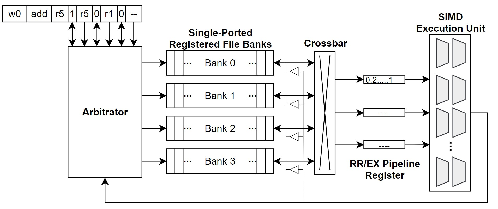
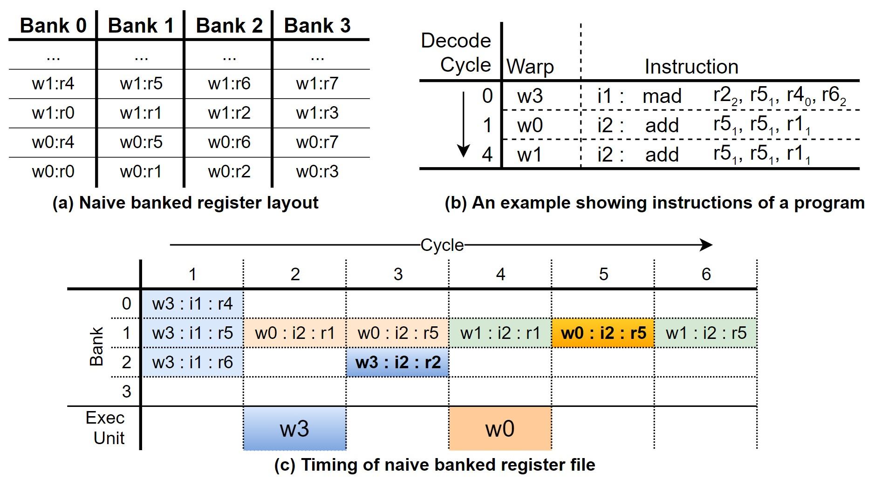
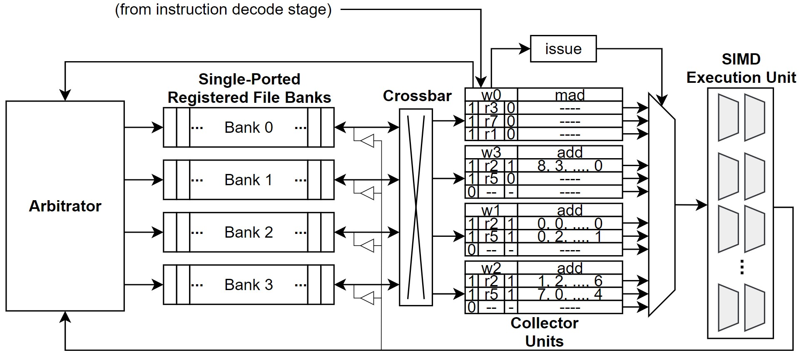
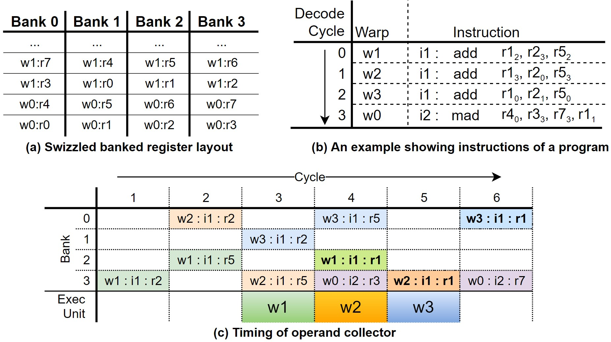

이전 글에 이어서 계속 하겠다.
이번 게시글은 two-loop approximation과 three-loop approximation에 대한 설명이다.
One-loop approximation이 단순한 GPU 구조를 가정했다면, two, three-loop approximation에서는 좀 더 복잡한 구조를 가정한다.
이를 통해 좀 더 현실에 가까운 GPU를 설명한다.

---

# Two-Loop Approximation

One-Loop Approximation에서는 한 번에 하나의 instruction만을 처리하도록 가정했다.
하지만 각 연산 코어가 처리해야할 warp의 수를 줄이면서 memory access latency를 숨기려면 여러 instruction을 연속적으로 처리할 수 있어야 한다.
하지만 여러 instruction을 처리하면서 warp 간 dependency로 인한 hazard를 해결하려면 추가적인 하드웨어가 필요하다.

따라서 two-loop approximation에서는 GPU에 instruction buffer를 도입했다.
여러 개의 scheduler가 instruction buffer를 살피며, dependency가 없는 instruction들을 꺼내 각 연산 pipeline에 할당하게 된다.
게다가 GPU의 instruction buffer는 MSHR과 함께 사용되며 cache miss latency를 좀 더 숨길 수 있다.

Instruction buffer에서 instruction 간의 dependency를 탐지하는 방법은 크게 2가지가 있다.
기존 CPU의 reservation station과 scoreboard이다.

Reservation station은 name dependency를 효과적으로 제거할 수 있지만 하드웨어 오버헤드가 큰 associative logic을 사용하기 때문에, GPU에선 scoreboard를 사용하는 것으로 추정된다.
Scoreboard의 경우 out-of-order 프로세서에서 매우 큰 오버헤드를 가지지만, in-order single threaded 프로세서에서는 매우 간단하게 구현될 수 있다.
그런데 GPU는 in-order multithreaded 프로세서로 볼 수 있다.
이때문에 scoreboard에 많은 수의 read port가 필요한데, 이를 해결하기 위해 다양한 연구가 있어왔다.

---

# Three-Loop Approximation

One-loop approximation에서는 한 번에 하나의 instruction만을 issue하는 간단한 GPU를 가정했다.
이 상황에서는 memory access latency를 숨기기 위해 많은 양의 warp가 필요했다.
하지만 한 번에 동작하는 warp의 수가 많아지면 register file의 크기가 커지게 된다.

이를 해결하고자 two-loop approximation에서는 warp들의 instruction dependency를 파악해 여러 instruction들을 연속적으로 issue하는 구조를 도입했다.
이를 위해 instruction buffer와 MSHR, scoreboard와 같은 하드웨어가 추가되었다.
하지만 여전히 동작 가능한 warp의 수가 많아야 latency hiding이 가능하기 때문에, register file의 크기는 클 수밖에 없다.

Three-loop approximation에서는 register file 최적화에 초점을 둔다.
기존 register file은 naïve 한 구조였기 때문에, cycle 마다 instruction이 issue 될 때 필요한 operand의 수만큼 port가 필요했다.
이러한 구조는 하드웨어 면적을 엄청나게 차지하기 때문에 비효율적이다.

이를 해결하는 방법 중 하나로, 하나의 port에 여러 bank를 두는 방식을 생각해볼 수 있다.
또다른 방법으로 operand collector란 것이 있는데, operand collector를 잘 이용하면 하나의 port에 여러 bank를 두는 것과 동일한 효과를 얻을 수 있다.

|  |
|:-------|
|Figure 1. Naïve 구조의 register file|

Operand collector를 자세하게 이해하기 위해, naïve 구조를 먼저 설명할 것이다.
**Figure 1.** 은 register file의 대역폭을 높이면서 port를 줄이기 위한 microarchitecture이다.
설명을 편하게 하기 위해, register file은 각 logical bank 마다 단일 port를 가진다고 가정한다.
따라서 GPU instruction pipeline에서 register read가 일어나게 되면, logical bank를 통해 데이터를 읽는다.
읽은 데이터는 crossbar를 통해 staging register (RR/EX Pipeline Register)으로 전달되고, 잠시 저장된 후 SIMD Execution Unit으로 전달된다.
Arbitrator는 instruction을 읽어, instruction에 해당하는 bank를 읽어 crossbar를 통해 적절한 staging register로 전달하게 된다.

|  |
|:-----|
|Figure 2. Naïve banked register의 레이아웃과 동작 예시|

Naïve microarchitecture에서는 각 warp에서 사용될 operand register는 **Figure 2.** 의 (a)와 같이 순차적으로 저장되게 된다.
이때, (b)와 같이 mad(w3), add(w0), add(w1) instruction이 순차적으로 들어온다고 가정해보자.
(b)에서 각 source/destination operand의 register 주소가 적혀있고, 각 register가 저장된 bank가 아래 첨자로 작성되어 있다.
서로 다른 bank는 동시에 접근이 가능하다는 점을 염두해두고 (c)를 살펴보도록 하자.

(c)는 (b)처럼 instruction이 들어왔을 때, instruction pipeline이 어떻게 동작하는지를 보여준다.
Bank라고 표기된 부분은 register operation을 나타낸다. Register write operation은 굵은 글씨체로 표현되어 있다.
Warp에서 사용될 모든 source operand가 모두 불러오면 execution unit을 통해 연산이 시작되는데, 이는 (c)의 Exec. Unit에 나타나있다.
먼저 cycle 1에서 w3의 mad instructon이 시작하게 되는데, source operand인 r5, r4, r6는 서로 다른 bank에 있기 때문에 모두 동시에 불러올 수 있다.
그리고 cycle 2가 되면, w3의 모든 source operand를 불러온 상태이기 때문에, w3는 execution unit으로 들어가게 된다.
그와 동시에, w0의 add instruction이 시작되는데, r5와 r1은 동일한 bank에 있기 때문에 1 cycle로 모두 불러올 수가 없다.
따라서 r1만 먼저 불러오게 된다.
그 다음 cycle 3에선 연산이 끝난 w3의 결과를 r2에 쓰기 위해, bank 2를 점유하게 된다.
그리고 이전에 불러오지 못한 w0의 source operand, r5,를 불러오게 된다.
이후의 동작도 모두 비슷한 방식으로 진행된다.

이처럼, bank conflict가 일어나면서 bank를 모두 사용할 수 없기 때문에 utilization이 떨어지게 된다.
이 때문에 instruction을 동작하는데 시간이 길어지게 되는데, 이를 해결하기 위해 operand collector가 도입되었다.

## Operand Collector

|  |
|:-------|
|Figure 3. Operand collector의 구조|

**Figure 3.** 은 operand collector 구조를 보여준다.
이전 구조와 가장 많은 차이를 보이는 부분은, RR/EX pipeline register가 collector unit으로 대체된 것이다.
Collector unit은 각 warp에 대한 instruction의 operand를 보관하고 있기 때문에, bank conflict 상황에서도 throughput을 향상시킬 수 있다.
게다가 operand collector는 별도의 스케쥴링 정책을 사용할 수 있기 때문에, bank conflict가 발생할 확률을 낮출 수 있다.

스케쥴링 정책은 다양하게 사용할 수 있지만, 가장 간단한 것은 다른 warp의 동일한 register는 다른 bank에 저장하는 것이다.
이 예시는 **Figure 4.** 의 (a) 그림을 통해 쉽게 이해할 수 있다.

|  |
|:-----:|
|Figure 4. Operand collector register의 레이아웃과 동작 예시|

이와 같은 스케쥴링 방식은 서로 다른 warp가 비슷한 진행 속도를 보일 때만 bank conflict를 줄일 수 있으며, 같은 instruction 내에서 일어나는 bank conflict는 해결할 수 없다.

(b)와 (c)는 operand collector가 적용됐을 때, GPU의 동작 예시를 나타낸다.
여기선 총 4개의 warp가 instruction을 수행한다.
하지만 naïve register file에 비해 bank conflict가 일어나는 횟수가 줄어들었기 때문에, 같은 cycle이더라도 더 많은 instruction을 수행한다는 것을 알 수 있다.

## Instruction Replay: Handling Structural Hazards

Operand collector와 같은 모듈은 bank conflict를 낮춰줌으로써, 성능 향상을 도모한다.
하지만 이와 같은 방법을 사용하더라도 모든 pipeline hazard를 제거할 수는 없다.
Operand collector가 가지는 가장 대표적인 문제는 write-after-read (WAR) hazard가 발생할 수 있단 것이다.
서로 다른 instruction 사이의 순서를 보장하지 않기 때문에, WAR hazard가 발생할 수 있다.

Pipeline hazard를 없앨 수 있는 가장 단순한 방법은 instruction을 다시 실행하는 것이다.
이러한 방식을 instruction replay라 하는데, GPU는 instruction buffer 내에서 dependency를 찾아 필요할 경우 instruction replay를 진행한다.

----

# 정리

이번 챕터에서는 두 게시글에 걸쳐서, GPU의 SIMT 연산에 대해서 자세히 다뤄보았다.
내가 설명하고 있는 책이 2018년도에 출판됐다보니, 벌써 GPU는 많은 것들이 바뀌었다.
하지만 큰 결은 여전히 비슷하기 때문에 GPU를 연구하는 연구자들은 게시글에서 많은 도움을 얻었으면 좋겠다.

이 책이 좋은 점은 다양한 시각에서 GPU의 문제점을 해결할 수 있는 research direction을 제시해준다는 것이다.
책의 내용을 나름대로 요약해서 게시글에 옮겨두긴 했지만, 좀 더 자세히 공부하고 싶은 분들은 책을 직접 읽어보기를 권장한다.

다음 챕터이자 마지막 챕터에서는 GPU의 메모리 계층구조에 대해서 설명할 것이다.

---

# 참고 자료

- T. M. Aamodt, W. W. L. Fung, and T. G. Rogers, General-purpose graphics processor architectures. San Rafael, California: Morgan & Claypool Publishers, 2018. doi: 10.2200/S00848ED1V01Y201804CAC044.

