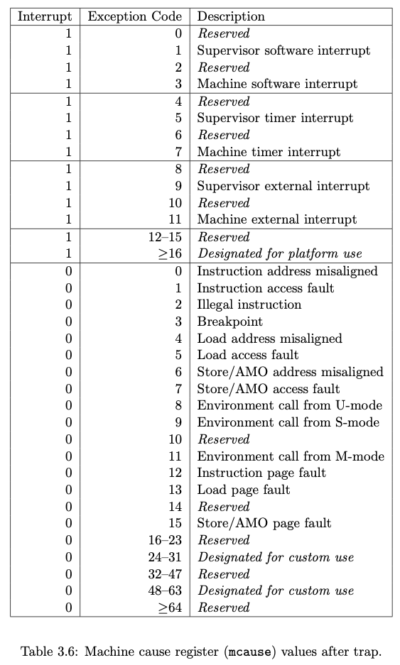
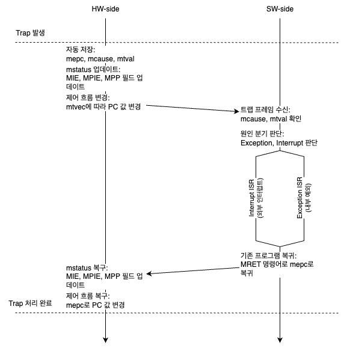

본 페이지에서는 RISC-V 베어메탈 환경에서 머신모드 트랩 처리 과정을 정리한다.

베어메탈 환경에서 모든 트랩(예외 및 인터럽트) 처리는 머신모드(M-mode)에서 이루어진다. RISC-V에서는 트랩 발생 시 하드웨어가 자동으로 관련 레지스터에 상태를 저장하고, 지정된 트랩 핸들러로 제어를 넘기는 메커니즘을 제공한다.

# 1. 기본 개념

**베어메탈 환경 (Bare-Metal):**

운영체제(OS) 없이 하드웨어 위에서 직접 실행되는 환경을 의미한다. 운영체제가 없기 때문에 초기 부트로더나 펌웨어가 하드웨어 자원을 직접 제어한다.
임베디드 시스템에서 주로 사용되기에 마이크로컨트롤러 기반의 기기 등을 베어메탈 환경이라고 부른다.

**RISC-V Trap:**

실행 중 예외(Exception)이나 인터럽트(Interrupt)가 발생하여, 현재 실행 흐름을 트랩 핸들러로 전환하는 사건을 의미한다.

트랩은 아래와 같이 분류된다.
- **예외 (Exception):**  
  동기적으로 발생하며 실행 중인 명령어의 오류(예: 잘못된 메모리 접근, 불법 명령어 실행)를 의미한다.
- **인터럽트 (Interrupt):**  
  비동기적으로 발생하는 이벤트(예: 타이머 인터럽트, 외부 장치 요청)로, 시스템 외부의 사건에 의해 발생한다.

트랩 핸들러는 주로 트랩 벡터(Trap vector) 코드로 제어되며, 트랩 벡터의 위치는 `mtvec`이라는 CSR에 저장되어 있어, 트랩 발생시 트랩 벡터를 호출하게 된다.

---

# 2. 머신모드 트랩 처리 단계

머신모드에서의 트랩 처리 과정은 하드웨어에 의해 몇 가지 주요 레지스터에 상태가 자동으로 저장된 후, 소프트웨어(트랩 벡터)가 트랩을 처리하고 다시 원래 실행 상태로 복귀하는 순서를 따른다. 세부 단계는 다음과 같다.

## 2.1 트랩 발생 및 자동 저장

트랩 발생 시, 하드웨어는 먼저 현재 실행 중이던 상태를 자동으로 저장한다. 이는 나중에 정상 복귀를 위한 기초 단계이다.

**`mepc` (Machine Exception Program Counter):**  
트랩이 발생한 명령어의 주소가 저장된다. 트랩 처리 완료 후 이 주소로 복귀한다.

**`mcause` (Machine Cause Register):**  
발생한 트랩의 원인(예외 코드나 인터럽트 번호)이 저장된다. 이를 통해 소프트웨어는 어떤 종류의 트랩이 발생했는지 확인할 수 있다.



**`mtval` (Machine Trap Value Register):**  
예외 발생과 관련된 부가 정보가 저장된다. 예를 들어, 잘못된 메모리 접근의 경우 접근한 가상 주소가 기록되며, 불법 명령어의 경우 해당 명령어 값이 기록된다.

`mtval`에 기록될 수 있는 값은 아래 표와 같다.

| 예외 종류                        | mtval 저장 내용                                |
|----------------------------------|------------------------------------------------|
| Misaligned, Fault, Page Fault    | 잘못된 메모리 주소 (Virtual Address)           |
| Illegal Instruction              | 예외를 발생시킨 명령어 값                       |
| Misaligned PC (잘못된 점프 주소)   | 비정상적인 점프 대상 주소                       |
| ECALL 등                         | 0 (의미 없는 값)                               |


---

## 2.2 `mstatus` 레지스터 업데이트

트랩 발생 시, 시스템의 현재 인터럽트 상태와 실행 모드 정보가 `mstatus` 레지스터에 저장되어야 한다. 변경되어야할 `mstatus`의 필드는 다음과 같다.

**`MPIE` (Machine Previous Interrupt Enable):**  
트랩 발생 전의 `MIE` 상태를 보존한다.

**`MIE` (Machine Interrupt Enable):**  
트랩 핸들러 실행 동안 추가 인터럽트 발생을 방지하기 위해 0으로 설정된다.

**`MPP` (Machine Previous Privilege Mode):**  
트랩 발생 전 실행 중이던 모드(User, Supervisor, 또는 Machine)를 저장하여, 복귀 시 원래 모드로 복원할 수 있도록 한다.

아래는 mstatus 업데이트 항목의 요약이다.

| 필드  | 설명                                                      |
|-------|-----------------------------------------------------------|
| MPIE  | 트랩 발생 전의 MIE 상태를 저장                             |
| MIE   | 트랩 처리 중 인터럽트 재진입 방지를 위해 0으로 설정          |
| MPP   | 트랩 발생 전 실행 모드(사용자, Supervisor, Machine)를 저장   |

> **참고:** Hypervisor 관련 기능이 활성화된 경우 `TVM`, `TW`, `TSR` 등의 필드가 특정 상황에 따라 변경될 수 있다.

---

## 2.3 트랩 벡터 설정 및 제어 흐름 이동

트랩 처리 시, 미리 설정된 트랩 벡터(`mtvec`)는 트랩 핸들러 코드(트랩 벡터)의 시작점을 제공한다.

참고로, `mtvec` 레지스터는 두 가지 동작 모드를 지원한다.

1. **Direct Mode (`mtvec.MODE = 0`):**
	- 모든 트랩 발생 시, 프로그램 카운터(PC)가 `mtvec.BASE` 주소로 설정된다.  단일 트랩 핸들러가 모든 종류의 트랩을 처리한다.
2. **Vectored Mode (`mtvec.MODE = 1`):**
	- 인터럽트 발생 시, PC가 `mtvec.BASE + (cause × 4)`로 계산되어 특정 원인에 따른 개별 핸들러로 분기된다.  단, 예외 발생 시에는 여전히 `mtvec.BASE` 주소를 사용한다.

아래는 트랩 핸들러 코드의 예시를 나타낸다.


---

## 2.4 머신모드 트랩 핸들러 내부 로직

머신모드 트랩 핸들러 코드(트랩 벡터)는 하드웨어가 저장한 상태 정보를 기반으로 문제 원인을 분석하고 처리한다.

1. **트랩 원인 분석:**  
   - `mcause`와 `mtval`을 검사하여 트랩이 예외인지 인터럽트인지 확인한다.
   - 예외일 경우: 잘못된 메모리 접근, 불법 명령어 실행 등으로 인한 오류 처리.
   - 인터럽트일 경우: 타이머 인터럽트, 외부 장치 요청 등 해당 서비스 루틴(ISR)을 호출.

2. **문제 해결 또는 복구 작업:**  
   - **예외 처리:**  
     복구 가능한 경우 관련 자료나 레지스터 정리 후, 트랩 발생 명령어 재실행 또는 에러 메시지 출력 등이 이루어진다.  
     복구 불가능한 경우 시스템 리셋 또는 종료를 진행한다.
   - **인터럽트 처리:**  
     해당 ISR을 호출하여 요청된 작업을 수행하고, 인터럽트 플래그를 클리어한다.

3. **상태 및 레지스터 업데이트:**  
   - 만약 트랩 처리 중 추가 트랩이 발생하면, 현재 트랩 핸들러 내에서 재진입(Recursive Trap Handling)을 지원하여 처리 후 원래 상태로 복귀할 수 있도록 한다.
   - 필요 시 스택에 현재 상태를 추가로 저장하여 중첩 처리를 관리한다.

---

## 2.5 복귀 (MRET 명령어)

트랩 처리가 완료되면, 머신모드에서는 `MRET` 명령어를 통해 원래의 실행 상태로 복귀한다.

- **PC 복원:**  
  `mepc`에 저장된 주소를 PC에 복원하여 트랩 발생 이전의 명령어로 돌아간다.
- **mstatus 복원:**  
  트랩 발생 전 저장했던 `MIE`와 실행 모드(`MPP` 등)를 `mstatus` 레지스터에서 복원하여 정상 상태로 돌아간다.

---

# 3. Supervisor 모드 트랩 처리 (참고)

베어메탈 환경에서는 기본적으로 머신모드에서 모든 트랩 처리를 수행하지만, 일부 시스템에서는 Supervisor 모드도 제공된다.  
Supervisor 모드로 트랩이 위임(delegate)되는 경우, 해당 트랩 처리는 재귀적으로 진행된다.  
즉, 머신모드 트랩 처리 루틴 내에서 추가 트랩 발생 시 이를 Supervisor 모드로 위임하여 처리하고, 이후 원래 머신모드 트랩 핸들러로 복귀하는 방식으로 관리된다.


---

# 4. 동작 정리



## 4.1. 하드웨어 사이드

```python
# 하드웨어는 트랩 이벤트 발생 시 자동으로 상태 레지스터를 저장하고,
# 트랩 벡터(mtvec)의 설정에 따라 적절한 핸들러 주소로 점프하는 역할을 수행한다.
# 이 코드는 하드웨어가 수행하는 동작(자동 저장, 인터럽트 차단, 벡터 계산 및 점프)을
# 소프트웨어적으로 모사한 것이다.

def hardware_trap_event(event):
    """
    event: {'trap_cause': int, 'trap_value': int} 형태의 딕셔너리
    """
    # [1] 현재 실행 상태를 자동 저장 (하드웨어 동작)
    mepc   = get_current_program_counter()    # 현재 명령어 주소
    mcause = event['trap_cause']                # 발생한 트랩 원인
    mtval  = event.get('trap_value', 0)           # 추가 정보
    mstatus = get_current_status_register()     # 현재 상태 레지스터 상태 (객체 형태)
    
    # 하드웨어는 내부에 트랩 프레임(저장 공간)을 생성해 저장한다.
    trap_frame = {
        "mepc": mepc,
        "mcause": mcause,
        "mtval": mtval,
        "mstatus": mstatus.copy()  # 현재 상태 복사
    }
    
    # [2] 인터럽트 차단을 위해, 하드웨어가 MIE 비트를 0으로 설정
    mstatus.MIE = 0
    set_status_register(mstatus)
    
    # [3] 트랩 벡터(mtvec)를 사용하여 핸들러 주소를 결정
    mtvec = get_mtvec()  # 예: {"mode": "Direct", "base_address": 0x8000_0000} 또는
                         #    {"mode": "Vectored", "base_address": 0x8000_0000}
    
    if mtvec["mode"] == "Direct":
        handler_address = mtvec["base_address"]
    elif mtvec["mode"] == "Vectored":
        # 인터럽트인 경우에만 offset 적용, 예외는 기본 주소를 사용
        if is_interrupt(mcause):
            handler_address = mtvec["base_address"] + (mcause * 4)
        else:
            handler_address = mtvec["base_address"]
    
    # [4] 하드웨어는 PC를 핸들러 주소로 설정하여 점프한다.
    set_program_counter(handler_address)
    
    # --- 여기서부터는 소프트웨어 트랩 핸들러로 제어가 이동한다 ---
    # (실제 하드웨어는 점프 후 자동으로 소프트웨어 핸들러 코드를 실행함)
    # 시뮬레이션을 위해 아래와 같이 호출할 수 있다.
    software_trap_handler(trap_frame)
```

## 4.2. 소프트웨어 사이드

```python
# 소프트웨어는 하드웨어가 전달한 트랩 프레임을 바탕으로
# 트랩 원인을 분석하고, 원인에 따른 예외나 인터럽트 서비스 루틴(ISR)을 실행한다.
# 또한, 트랩 처리 후에는 이전 상태를 복원하고, 원래 실행 흐름으로 복귀한다.

def software_trap_handler(trap_frame):
    """
    trap_frame: 하드웨어가 저장한 트랩 관련 정보가 담긴 딕셔너리
    """
    mcause = trap_frame["mcause"]
    mtval  = trap_frame["mtval"]
    
    # Direct Mode에서는 하나의 트랩 핸들러 함수 내에서 원인을 판별
    if is_exception(mcause):
        handle_exception(mcause, mtval)
    elif is_interrupt(mcause):
        handle_interrupt(mcause, mtval)
    
    # 트랩 처리 후, 저장된 상태를 복원하여 원래 실행 상태로 복귀
    restore_trap_state(trap_frame)

def handle_exception(cause, value):
    if cause == ILLEGAL_INSTRUCTION:
        log(f"Illegal instruction exception: {value}")
        perform_system_reset()
    elif cause == LOAD_FAULT:
        log(f"Load fault at address: {value}")
        attempt_recovery()
    elif cause == ECALL:
        log("ECALL exception encountered")
        perform_ecall_service()
    else:
        log(f"Unknown exception: {cause}")
        perform_system_reset()

def handle_interrupt(cause, value):
    if cause == TIMER_INTERRUPT:
        log("Handling timer interrupt")
        service_timer_interrupt()
    elif cause == EXTERNAL_INTERRUPT:
        log("Handling external interrupt")
        service_external_interrupt()
    elif cause == SOFTWARE_INTERRUPT:
        log("Handling software interrupt")
        service_software_interrupt()
    else:
        log(f"Unknown interrupt: {cause}")

def restore_trap_state(trap_frame):
    """
    저장된 상태(trap_frame)를 복원하고, MRET 명령어 동작을 모사한다.
    """
    # mstatus 복원
    set_status_register(trap_frame["mstatus"])
    # mepc 값을 프로그램 카운터로 복원하고, MRET 실행
    set_program_counter(trap_frame["mepc"])
    execute_MRET()
```


---
# Related
- 
