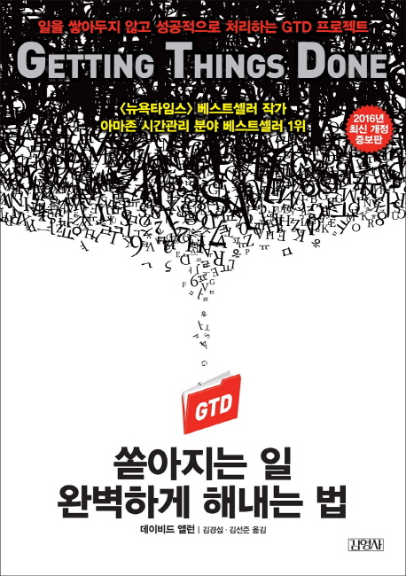
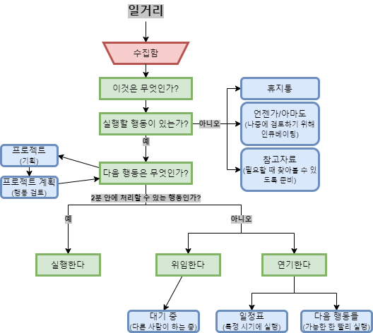

MBTI에서 INFJ-T, 그중에서도 뚜렷한 J 성향인 나는 계획이 없고, 정리가 안 되어 있는 꼴을 잘 못 본다.
그래서 나는 모든 걸 정리하려고 시도한다.

방부터 시작해서 내가 일하는 연구실 책상 등의 공간뿐만 아니라, 하루 일정부터 주간 계획, 월간 계획 등의 시간도 내 정리의 대상이다.

나는 시간을 정리하기 위해서 구글 태스크를 사용했었는데, 기본적인 기능 이외엔 특별한 기능도 없거니와, 구글 캘린더에 빌트인으로 사용하는 방식이라 너무 불편했다.
그래서 다른 프로그램을 찾아봤는데, 가장 먼저 발견한 것이 투두이스트였다.
구글 캘린더와 연동이 된다는 점이 상당히 마음에 들었는데, 그래서 투두이스트에 대해서 이런저런 [자료](https://todoist.com/productivity-methods/getting-things-done)들을 찾아보다가 GTD라는 방법론을 알게됐다.

최근 점점 많아지는 일과 체계적이지 못한 관리 방법으로 인해 정리에 드는 노력이 이전보다 확연히 늘어나게 되었다.
이로 인한 스트레스가 늘어가는 와중, GTD가 한 줄기의 빛 같은 느낌으로 다가왔기 때문에 바로 책을 구매해 읽어봤다.

|   | 
| :----------------------------------------|
| 저자: 데이비드 앨런 역자: 김경섭, 김선준 출판사: 김영사 출간일: 2016년 07월 04일 |

------
# GTD란?

GTD는 Getting Things Done의 약자로 생산성 컨설턴트인 데이비드 앨런(David Allen)이 고안한 할 일 관리(Task management) 방법론이다.

이 책의 첫 장에서는 GTD의 핵심 기술에 관해서 이야기한다.
둘째 장에서는 GTD를 실제로 삶에 적용하기 위한 도구와 행동지침에 관해서 이야기한다.
마지막 장에서는 GTD를 통해 얻을 수 있는 결과를 설명하며, GTD가 왜 잘 동작하는지에 대한 근거를 인지심리학의 관점에서 살펴본다.

이번 포스트에서는 책에 대한 리뷰와 함께, 내가 GTD 방법론에 대해 공부하면서 배우게 된 내용을 다뤄볼 것이다.

------
# GTD가 필요하게 된 배경

20세기에 들어서면서 단순한 육체 노동보다 지식 노동을 하는 사람들이 늘었다.
지식 노동의 문제점은 프로젝트 사이의 경계가 매우 모호하다는 것이다.
경계가 모호하면 프로젝트를 개선하기 위해 얼마만큼의 노력과 시간을 투자해야 하는지 명확하지 않다.
이런 이유로 한 사람이 감당할 수 있는 양보다 많은 양의 일이 할당된다.
게다가 업무 환경과 사회가 급속도로 바뀌고 있기 때문에 직무와 생활 역시 변화무쌍하다.

단순한 방식으로 여러 일을 처리하는 것은 금세 머릿속이 복잡해지기 마련이고, 이는 삶에 크나큰 스트레스로 다가온다.
따라서 명확하고 뚜렷한 방식으로 일들을 처리해야 하는데, 이때 등장하는 것이 GTD이다.

-----
# GTD의 목표

GTD는 기본적으로 할 일 관리 방법론이지만 이와 동시에 스트레스 관리법이기도 하다.
GTD에서는 삶의 미해결 과제를 "열린 고리", "미완의 일" 등으로 부른다.
열린 고리가 생기게 되면 신경을 쓰게 되고, 집중력이 하락한다. 집중력 하락은 생산성을 저하하게 되고 이는 스트레스를 유발한다.
따라서 이 열린 고리에서 오는 신경 쓰임을 관리하는 것이, 곧, 생산성 관리이자 스트레스 관리라고 이야기한다.

이 열린 고리들은 GTD의 3가지 핵심 원리를 통해 관리할 수 있다고 한다.

1. 주어진 일들을 모두 모은다.
	- 주어진 일들은 머리와 마음속이 아닌, 외부에 존재하는 신뢰할만한 시스템을 활용해 처리해야 한다.
	  사람들은 일이 생기면 머릿속에서만 판단을 하고 결론을 짓게 된다. 하지만 뇌는 신뢰할만한 도구가 아니기 때문에 많은 문제가 발생한다.
2. 모은 일을 세부적인 할 일들로 나눈다.
	- 일은 두루뭉술하고 실행할 수 없는 계획이 아닌, 실행할 수 있는 '할 일'로 정의되어야 한다.
	  무엇을 할 것인지 미리 정의해두면, 해야 할 때가 됐을 때 추가적인 단계 없이 바로 일을 할 수 있게 된다.
3. 할 일들을 언제 어디에서 할 것인지를 정하고, 때가 되면 실행한다.
	- 할 일들을 각각 정의했지만, 언제 어디서 할 것인지 정하지 않았다면 부랴부랴 정하느라 바로 일을 할 수 없게 된다.

-----

# 업무 흐름 관리의 다섯 단계

저자는 이 열린 고리들을 관리하기 위해 업무 흐름 관리의 다섯 단계(5 steps of workflow management)를 제안한다.

**1. 수집 (Capture)**
**2. 명료화 (Clarify)**
**3. 정리 (Organize)**
**4. 검토 (Review)**
**5. 실행 (Engage)**

|   |
|:-----:|
|그림 1. GTD의 업무흐름 도표|

## 1. 수집 (Capture)
수집 단계에서는 모든 미완의 일을 하나라도 빠짐없이 수집한다.
사적이든 공적이든, 크든 작든, 급하든 중요하지 않든 상관없이 모든 열린 고리를 수집한다.
이때, 수집 단계를 성공적으로 마치기 위해 명심해야 할 사항들이 있다.

- 일들은 전부 머릿속에서 꺼내라.
- 수집공간의 개수는 최소화하라.
- 수집함은 정기적으로 비워라.

수집 단계는 **그림 1** 의 빨간색 부분이다.

## 2. 명료화 (Clarify)
수집함에 수집된 열린 고리들은 명료화 단계에서 비워진다.
비우는 과정은 **그림 1** 의 녹색 부분의 흐름대로 진행된다.
각 흐름에 대해서 살펴보겠다.

- **이것은 무엇인가?**
  일거리가 무엇이며, 이에 관해서 어떤 것을 해야 하는지는 매우 중요하다. 우리는 업무 도중에 다양한 형태의 일거리들을 받는다.
  이 일거리들은 대부분 형태가 확실하지 않기 때문에 무엇인지 미리 판단하지 않는다면 중요한 일거리라도 내팽개쳐질 수 있다.

- **실행할 행동이 있는가?**
  이 질문은 "예"와 "아니오"로 나뉜다. 대답이 "아니오"라면, 처리 방법은 또다시 세 가지로 나뉜다. 이들은 세 번째 단계인 정리 단계에서 좀 더 자세히 다루도록 하겠다.

- **다음 행동은 무엇인가?**
  이전 질문인 "실행할 행동이 있는가?"에서 대답이 "예"라면, 행동이 가능한(actionable) 일거리이다. 물리적으로 행동이 가능한 일거리에 대해서만 "예"라는 대답이 내려져야 한다.

- **실행한다?, 위임한다?, 연기한다?**
  다음 행동을 결정했다면, 이제 세 가지 옵션이 있다.
  1. **실행한다.**
  2분 안에 끝낼 수 있는 행동이라면 당장 처리한다. 2분이라는 숫자는 저자가 임의로 정한 상징적인 숫자이다.
  실제로 일을 처리하는데 2분 이상 걸릴 수도 있으나, 금방 끝낼 수 있는 일은 빠르게 처리하라는 의미로 받아들이면 된다.
  2. **위임한다.**
  2분 넘게 걸리는 행동이라면 먼저, 내가 이 일을 하기에 적당한 사람인지 질문해본다. 그렇지 않다면 다른 적절한 사람에게 위임한다.
  3. **연기한다.**
  그 행동을 끝내는 데 2분 넘게 걸리고 내가 적임자라면, 당장 실행하지 않고 나중으로 미룬다. 이후, 수집함의 목록들을 재차 확인한다.
  이게 무슨 뜻이냐면, 2분 내로 끝나는 일들을 모두 처리한 뒤, 연기된 일을 처리하라는 뜻이다.

## 3. 정리 (Organize)
**그림 1** 의 파란색 부분은 분류된 일거리들을 의미한다. 이들에 대해서도 각각 설명하도록 하겠다.

- **프로젝트**
  저자는 '프로젝트'를 하나 이상의 행동단계가 필요하고 1년 이내에 완수할 수 있는 어떤 원하는 결과라고 정의한다.
  즉, 중요하지 않더라도 일련의 행동들의 단계로 이루어져 있다면 프로젝트로 정의할 수 있다.
  이렇게 프로젝트를 정의하는 이유는 한 단계만으로 일이 끝나지 않았기 때문에 다음 단계가 있다는 걸 상기시켜주기 위해서이다.
  그래서 프로젝트는 따로 보관/관리하면서 주기적으로 검토하는 것이 좋다.

  프로젝트는 기획과 행동 검토, 두 단계로 구분이 된다.
  기획 단계에서 프로젝트의 목표는 무엇이며, 현재 어느 정도 진행이 되었는지 검토한다.
  행동 검토 단계에서는 목표를 달성하기 위해서 다음 행동으로 어떤 게 있는지 생각한다.

- **다음 행동**
  업무 흐름 도표에서 가장 중요한 단계이다. 프로젝트이건 아니건 다음 행동은 여기서 검토된 후 실행된다.
  그중에서도 2분 내로 처리할 수 없는 행동들은 이 단계에서 확인돼야 한다.
	- **대기 중**
	  현재 다른 사람에게 위임된 일이다. 이 일은 단순히 상황만 추적하면 된다.
	- **일정표**
	  실행해야 하는 것들이 특정한 날짜나 시간에 해야 한다면 이 범주로 들어오게 된다.
	  일정표에는 특정 시간에 해야 하는 행동, 특정 날짜에 해야 하는 행동, 특정 날짜와 관련된 정보를 기재한다.
	  나머지는 전혀 기록할 필요가 없다.
	- **다음 행동들**
	  처리에 2분 이상 걸리며 위임할 수 없다고 판단된 일들은 조만간 다시 상기해야 한다.
	  따라서 목록에 기재해둔 뒤 주기적으로 검토한다.
	  판단하기에 현재 상황에 행동이 가능하다면 행동을 처리한다.

- **취할 행동이 없는 항목들**
  현재 행동을 취하지 않아도 되거나 할 수 없는 항목들은 개별적인 시스템을 통해 관리한다.
	- **휴지통**
	  실행할 행동이 없는 항목들 가운데 쓸모없다고 판단되는 행동들이다. 이들은 과감히 버린다.
	- **언젠가/아마도**
	  행동이 가능하더라도 지금 당장 실행할 수 있는 상황이 아니라면 나중에 재평가하기 위해 인큐베이팅해둔다.
	  이때 특정한 시간이 왔을 때 상기시켜줄 장치만 있다면 충분하다.
	 - **참고자료**
	   행동이 가능한 일들은 아니지만, 일거리에 도움이 되는 자료들은 다시 찾을 수 있도록 항목별로 분류하여 보관한다.

## 4. 검토(Review)
할 일 관리의 핵심은 검토단계를 꾸준히 했을 때이다. 이전 단계를 통해 정리된 할 일들은 주기적으로 검토되어야 한다.
일간검토를 통해 추가된 할 일은 없는지? 지금 당장 할 수 있는 일은 없는지? 따져본다.
아래 사항들을 중점적으로 본다면 보다 효과적인 검토가 가능하다.
- 일거리들을 모아 판단한다.
- 시스템을 검토한다.
- 목록을 갱신한다.
- 깔끔하게, 명확하게, 최신 정보로, 완전하게 만든다.

## 5. 실행(Engage)
모든 것을 정리하고 검토했다면 실제로 실행을 하면 된다.
이때 어떤 게 중요한 일이고 아닌지 매번 확신을 갖고 결정할 수 없다.
가장 좋은 답은 직관을 믿는 것이지만 이 역시 부족할 수 있다.
그래서 저자는 직관적 선택에 도움을 줄 행동 선택을 위한 세 가지 모델을 제안했다.

1. 주어진 순간의 행동 선택을 위한 네 가지 기준 모델
  아래 기준들의 관점에서 행동 선택을 한다.
  - 상황
  - 이용할 수 있는 시간
  - 쓸 수 있는 에너지
  - 상황, 시간, 에너지를 고려했을 때의 우선순위

2. 일과를 확인하기 위한 3중 모델
  아래 선택들의 관점에서 행동 선택을 한다.
  - 미리 정해진 일을 한다.
  - 예상하지 못했지만, 즉석에서 생긴 일을 한다.
  - 일을 정의한다.

3. 일을 검토하기 위한 여섯 단계 모델
  아래 가치들의 관점에서 행동 선택을 한다.
  - 지평선5: 목적과 원칙
  - 지평선4: 비전
  - 지평선3: 목표
  - 지평선2: 포커스의 영역과 책임
  - 지평선1: 현재 프로젝트들
  - 기초: 현재 행동들
  
---------------

이 책에서는 업무와 할 일을 효율적으로 관리하기 위한 3가지 핵심 원리를 전제로 여러 이야기를 풀어나간다.
저자는 3가지 핵심 원리를 성공적으로 완수시킬 업무 흐름 관리의 다섯 단계를 제시했으며, 각 단계들을 어떻게 진행해야 하는지 자세하게 설명한다.

위에 내가 정리한 내용은 책의 1장의 일부이다.
2장에서는 각 단계들을 실생활에 적용하기 위한 지침과 활용 가능한 도구와 같이 가이드라인에 가까운 글을 매우 상세히 보여준다.
3장에서는 GTD를 통해 얻을 수 있는 결과, 인지과학의 관점에서 GTD의 근거 등을 소개한다.

요즘과 같이 스마트한 디지털 기기들과 밀접한 시대에 살고 있으면서 내 행동은 여전히 비효율적인 방식들에 의존해있었다.
나 스스로 나에게 걸맞은 워크플로우를 찾을 수도 있었겠지만, 세상엔 나보다 훨씬 더 똑똑하고 훨씬 더 집요한 사람들이 많기 때문에 그 사람들의 지혜를 빌리고자 여기저기를 찾아봤다.
GTD는 그러다가 발견하게 되었다.
이미 생산성이란 키워드에 대해 관심을 가져본 사람들은 한 번 쯤은 들어봤을 방법론이지만 나에게 너무 생소한 주제였고 인상 깊었기 때문에 GTD에 대해 알게 되자마자 바로 책을 사서 읽어보게 되었다.

지금은 투두이스트를 활용해서 GTD 시스템을 구축해보고자 조사해보고 있다.
이외에도 개인지식관리(Personal knowledge management)에도 관심이 있어, GTD와 같은 Task management 방법론과 결합을 시켜볼 생각이다.
이미 해외에서는 둘을 통합하기 위해 많은 시도가 있어왔고 다양한 담론들도 이어진 모양이다.
나도 빨리 체계적인 시스템을 구축해서 일이 넘쳐서 허둥지둥대는 상황이 없었으면 좋겠다.

------

# 참고자료

- [투두이스트-생상선 방법론](https://todoist.com/productivity-methods)
- [GTD(Getting Things Done)를 활용한 투두이스트(Todoist) 활용법 (tistory.com)](https://reviewjason.tistory.com/3)

