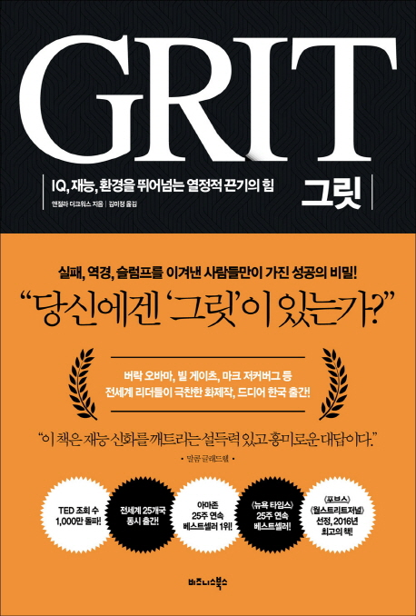

책장에 오랜기간 꽂아둔 채 먼지만 쌓였던 책인데, 최근 다시 꺼내들게 되었다.
책의 저자인 앤절라 더크워스는 심리학자인데, 성공한 사람들에 대해 오랜기간 연구해왔다.

이 책은 연구의 결과로 얻은 하나의 개념, 그릿에 대해 다루고 있다.

| |
|:---|
|저자: 앤절라 더크워스 역자: 김미정 출판사: 비즈니스북스 출간일: 2016년 10월 28일|

---

# 그릿(Grit)이란?

저자인 앤절라 더크워스에 의하면 **그릿(Grit)은 장기 목표에 대한 인내와 열정(perseverance and passion for long-term goals)** 라고 한다.
즉, 인생 목표를 실현하기 위한 끈기 있는 자세, 지속적인 열정이라고 할 수 있다.

대부분의 사람들은 이미 끈기와 열정이 중요하다는 사실을 알고있다.
하지만 저자는 연구를 통해 그릿을 정량적으로 측정을 하는 방법을 개발했고, 여러 사례들(아이비리그 학부생의 GPA, 미국 육군사관학교 사관후보생 자퇴율, 내셔널 스펠링비 순위 등) 에 대해 그릿을 측정했다.
이를 통해 실제로 그릿이 높은 사람들은 실패를 겪어도 금방 털고 일어나 다시 목표를 향해 나아간다는 것을 발견했다.

결론적으로 책에서는, 지능지수나 재능보다 끈기, 열정이 더욱 중요하다는 것을 이야기한다.

---

# 그릿을 발달하기 위한 심리적 자산

업무에서 높은 성과를 보이는 그릿의 전형들은 열정, 연습, 목적, 희망이라는 총 4가지 공통적인 심리적 자산을 갖고 있다.
그리고 이들 모두 타고나는 것이 아니라, 발전시켜 나갈 수 있는 것이라 얘기한다.

## 열정

본인이 하는 일에 깊은 열정이 있어야 한다.
깊은 열정이 있다고 해서 일의 모든 부분에 재미가 있는 것은 아니다.
재미가 없는 부분 역시 있지만, 대체로 자신의 일에 푹 빠져 있고 일에 의미를 발견한다.

특정 분야에 대한 열정은 갑작스럽게 나타나는 것이 아니다.
열정은 점진적으로 커지는 것이며, 무언가에 관심을 갖고 계속 탐구를 하게 되면 열정은 계속 커져간다.
동일한 분야에 열정을 가진 사람과의 상호작용, 역량의 발전으로 분야에 대한 이해도가 높아짐에 따른 흥미 등을 통해 열정은 점진적으로 커진다.

## 연습

본인의 역량을 지속적으로 발전시킨다. 언제나 어제보다 잘하려고 노력하며, 매일 단련한다. 현재에 안주하지 않으며 지금보다 나아지려 끈기를 갖고 노력한다.

연습은 단순한 반복이 아니다. 질적으로 차별된 연습을 통해 역량을 발전시켜야 한다.
저자는 이를 의식적 연습이라 칭하는데, 의식적 연습을 하기 위해서는, 약점에 치중해야 하며, 도전적 목표를 설정하고, 부정적 피드백을 적극 수용해야 한다고 말한다.

## 목적

자신의 일이 중요하다는 확신을 갖는다. 목적이 없는 관심을 평생 유지하는 것은 불가능하다. 개인적으로 흥미로운 일이면서 타인의 안녕에도 밀접한 관련이 있어야 한다.

그릿이 높은 사람들은 자신 뿐만 아니라 타인을 생각하는 높은 목적의식을 갖고 있다.
저자는 높은 목적의식 역시 의도적인 훈련이 가능하다고 주장한다.
본인의 업무가 사회에 어떤 긍정적 기여를 하는지를 생각하고, 롤모델을 찾는 과정을 통해 높은 목적의식을 얻을 수 있다고 한다.

## 희망

희망은 위기에 대처하게 해준다. 희망을 따로 다루기는 했지만, 관심, 연습, 목적 모든 심리적 자산에 연관되어 있다. 상황이 어려울 때나 의심이 들 때도 희망을 유지하면 위기를 대처할 수 있다.

---

책에서는 이외에도 다양한 사례를 통해, 그릿을 개발하는 여러 방식에 대해 소개한다.
그리고 그릿이 높은 아이를 위한 양육방식에 대해서도 소개했는데, 나의 경우 이 부분은 읽어보지 않았다.

그릿이란 개념이 그리 오래되지 않다 보니, 학계에서는 그릿의 실효성에 대해 갑론을박이 오가고 있는 것 같다.
하지만 일반인 입장에서는 이러한 개념이 있다는 것을 알고 동기부여를 얻는 것만으로도 충분하지 않을까 생각된다.

---

# 참고자료

- [그릿 - 위키백과, 우리 모두의 백과사전 (wikipedia.org)](https://ko.wikipedia.org/wiki/%EA%B7%B8%EB%A6%BF)
